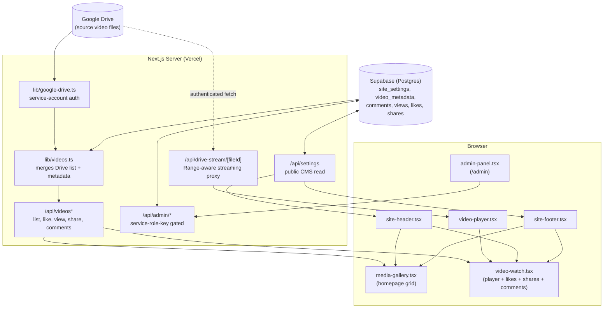

# Architecture

How the pieces of fgs-praise26 fit together. This reflects the actual state of the repo, not a plan — update it as things change.

---

## 0. System Diagram



**Reading this diagram:**
- **Google Drive** only ever holds raw video files — nothing about them is stored there except the bytes.
- **Supabase** is the source of truth for everything *about* a video (title, category, featured flag) and all engagement data (views/likes/shares/comments) plus site-wide CMS content (`site_settings`).
- The **streaming proxy** (`/api/drive-stream/[fileId]`) is the only place video *bytes* flow through — it authenticates to Drive as a service account and streams the file back through our own domain, so the browser never talks to Drive directly.
- `site-header.tsx` / `site-footer.tsx` are shared components that independently fetch `/api/settings`, which is why they can be dropped into both the homepage and the watch page.
- `/admin/*` routes are the only ones allowed to write to Supabase — they use the service role key, which bypasses Row Level Security.

---

## 1. High-Level Flow

```
Google Drive (source video files)
        │
        ▼
lib/google-drive.ts  ──────►  app/api/drive-stream/[fileId]/route.ts
(service-account auth,             (authenticated streaming proxy,
 lists files in the folder)         Range-header aware, supports ?download=1)
        │                                   │
        ▼                                   ▼
lib/videos.ts                        components/video-player.tsx
(merges Drive file list with          (routes /api/drive-stream/ URLs
 public.video_metadata from            to a real <video> tag)
 Supabase — titles, categories,
 featured flags, etc.)
        │
        ▼
components/media-gallery.tsx  (homepage grid)
components/video-watch.tsx    (watch page: player + likes + shares + comments)
```

Supabase is the source of truth for everything *about* a video (title, description, category, featured/published flags) and all engagement data (views, likes, shares, comments). Google Drive is only the source of the raw video *files*.

---

## 2. Why a Streaming Proxy for Google Drive?

Two things were tried and rejected before landing on the current approach:

1. **Drive iframe embeds** — caused double UI chrome and letterboxing (Drive's own player wrapped inside the site's player).
2. **Direct `<video src="drive.google.com/...">`** — triggers Drive's virus-scan interstitial page instead of playing.

**Current solution:** `app/api/drive-stream/[fileId]/route.ts` authenticates as a Google service account (via `lib/google-drive.ts`), fetches the file directly from the Drive API, and streams it back through our own domain. It:
- Respects the `Range` header so seeking and progressive playback work (`206 Partial Content`)
- Supports `?download=1` to force a real file download (sets `content-disposition: attachment`)

`components/video-player.tsx` detects `/api/drive-stream/` URLs and renders a native `<video>` tag against them (as opposed to any other source type it might need to handle).

**Gotcha already hit once:** `app/globals.css` had leftover rules hiding native `<video>` controls (`video::-webkit-media-controls-*`), left over from the old iframe approach. If native controls ever disappear again, check there first.

---

## 3. Database Schema (Supabase)

All tables live in `supabase/schema.sql`, which is safe to re-run (`create table if not exists`).

| Table | Purpose | Notes |
|---|---|---|
| `site_settings` | Singleton row (CMS content) — church name, hero text, footer text, social links, featured video | `id boolean primary key default true` forces exactly one row |
| `video_metadata` | Per-video CMS data keyed by `drive_file_id` | title, description, category, featured/published flags, display order |
| `comments` | Comments + one level of threaded replies | `parent_id` references `comments.id`; enforced server-side that a reply's parent must itself be top-level (no reply-to-reply) |
| `video_views` | One row per watch session | keyed by `viewer_key` (device/browser identifier), not per-video-unique — supports re-views |
| `video_likes` | One row per (video, liker) pair | composite primary key `(drive_file_id, liker_key)` — a like is a toggle, not a counter |
| `video_shares` | One row per share action | no uniqueness constraint — a person can share the same video multiple times |

**Row Level Security:** enabled on every table. Public (anon key) can `select` published/approved content and `insert` engagement rows (views, likes, shares, comments). All **admin writes** (editing metadata, approving/deleting comments, editing site settings) go through server-side routes using `SUPABASE_SERVICE_ROLE_KEY`, which bypasses RLS — the service role key must never be exposed client-side.

**Comments are currently auto-approved on insert** (`approved: true` at insert time) — the `approved` column and its RLS policy still exist but there's no active moderation queue in the UI right now.

---

## 4. API Routes

### Public
| Route | Purpose |
|---|---|
| `GET /api/videos` | List videos (merged Drive + metadata) |
| `GET /api/videos/[id]` | Single video detail |
| `GET/POST /api/videos/[id]/comments` | List comments (with `parent_id` for replies) / post a comment or reply |
| `POST /api/videos/[id]/like` | Toggle a like for the current viewer |
| `POST /api/videos/[id]/view` | Record a view |
| `POST /api/videos/[id]/share` | Record a share event |
| `GET /api/settings` | Public read of `site_settings` (powers header/footer/hero content) |
| `GET /api/drive-stream/[fileId]` | Streams video bytes from Drive (Range-aware) |

### Admin (service-role-key gated)
| Route | Purpose |
|---|---|
| `/api/admin/videos` | Create/edit video metadata |
| `/api/admin/comments` | Moderate comments (approve/delete) |
| `/api/admin/settings` | Edit `site_settings` (CMS content) |

**Error-handling gotcha:** Supabase's `PostgrestError` is not an instance of JS `Error`, so `error instanceof Error ? error.message : "generic fallback"` silently swallows real Supabase error messages. Routes now fall back to `(error as {message?: string})?.message` to surface the actual cause — worth keeping this pattern in any new route that talks to Supabase.

---

## 5. Comments & Replies System

- **One level of nesting only** — a comment can have replies, but replies cannot have replies. Enforced in the POST handler: if `parent_id` is supplied, the route checks the parent exists *and* is itself top-level before inserting.
- **UI (`components/video-watch.tsx`):**
  - Comments section is collapsed by default (`showComments` state), toggled open by a "Comments (N)" header with a rotating chevron.
  - Paginated client-side: shows 5 top-level comments at a time (`visibleComments`), with a "Show more" button. Pagination only counts top-level comments — replies don't count against the limit.
  - Each commenter gets a deterministic colored avatar circle (`avatarColor(name)`, hash-based — there are no real user accounts, so this is a stand-in for a profile picture).
  - Timestamps are relative (`timeAgo()` — "2h", "1d", "3w") rather than absolute dates, matching X/Instagram conventions.
  - Visual style: borderless, divided by a hairline (`border-bottom` on `.comment-thread`, none on `:last-child`) rather than boxed cards — this was a deliberate revision after the first boxed-card version felt "childish."
  - Replies are visually indented (`.comment-replies`, left border + margin) under their parent.

---

## 6. Shared Header/Footer

`components/site-header.tsx` and `components/site-footer.tsx` are self-contained — each fetches its own data from `GET /api/settings` rather than receiving props — so they can be dropped into both the homepage (`media-gallery.tsx`) and the watch page (`video-watch.tsx`) without prop drilling.

- **Header:** just the official church logo (`site_settings.logo_url`, falling back to a hardcoded default church logo URL). No text wordmark alongside it.
- **Footer:** church mark, a Bluezo-Tech blurb (`site_settings.footer_text`), five colored circular social badges (GitHub/Instagram/X/TikTok/LinkedIn — currently hardcoded Bluezo-Tech URLs, not yet CMS-driven), a Media links column, a Connect (mailto) column, a "For You" column with a live TikTok embed, and a "Built by Bluezo Tech" gradient pill badge.
- Nav links use absolute paths (`/#library`, `/#about`, `/#top`) so they resolve correctly from the watch page too, not just the homepage.

---

## 7. Analytics

`@vercel/analytics` is wired in at the root: `app/layout.tsx` imports `Analytics` from `@vercel/analytics/react` and renders `<Analytics />` inside `<body>`, after `{children}`. Data shows up in the Vercel dashboard's Analytics tab once the site receives real traffic — no other configuration needed.

---

## 8. Deployment Workflow

- Vercel project `fgs-praise26` (team `bluezo-techs-projects`) is **Git-linked** to `main` on GitHub. Every `git push origin main` triggers an automatic production deploy.
- Direct `vercel --prod` CLI deploys have been unreliable (network timeouts) — **git push is the standard path**, CLI is a fallback only.
- Environment variables are managed in the Vercel dashboard and must be kept in sync with `.env.local` manually (`vercel env add/rm <NAME> production`).

---

## 9. Known Gaps / Not Yet Built

- **CMS is not fully editable yet.** `site_settings` covers header/footer/hero text and social *link URLs*, but things like the footer social *badge set*, the homepage category list (`CATEGORIES` array, currently hardcoded in `media-gallery.tsx`), and the About section copy are not yet wired to the admin panel.
- **No moderation queue in the UI** even though the `approved` column and RLS policy still exist — comments auto-approve.
- **`fix-replies.js` and `fix-timeago.js`** in the repo root are one-off Node scripts used during development to safely apply exact-text edits to `video-watch.tsx` (in place of risky line-number-based `sed` edits). They're not part of the app's runtime and can likely be deleted once confirmed unneeded, but are left in place for reference.